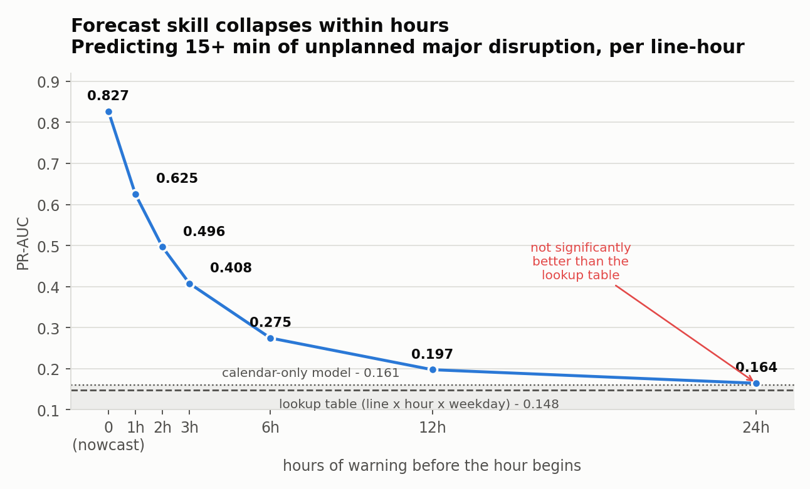
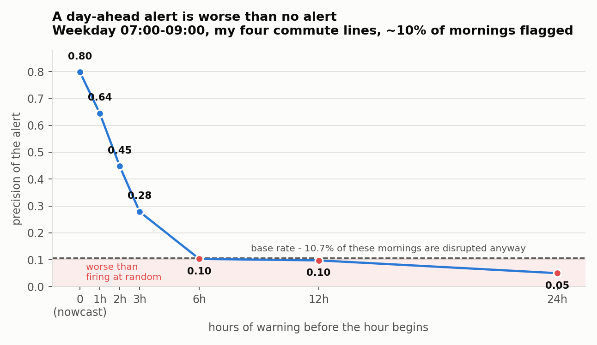

# TubeCast

**How far ahead is London Underground disruption actually predictable?**

Most tools tell you the Tube is delayed once it already is. I wanted to
know whether it can be called in advance — and if so, how far in advance
before the signal runs out.

This repo has the data pipeline and the analysis. Modelling results are
in progress; what's established so far is below, and what isn't is marked
as such.

---

## Where the data came from

I filed a Freedom of Information request with TfL for historical delay
records. They refused it under Section 21 — already publicly
available — and the refusal notice pointed me at a better dataset than
the one I'd asked for: a service status message log covering
**101,719 events from April 2022 to August 2026**, one row per status
change per line, with timestamps and free-text causes.

That log records *changes*, not states — "Good Service" appears 18 times
in 101,719 rows, because it's the implicit default between events. To
model it you need a continuous timeline, so the build reconstructs one:

```
101,719 status-change events  →  385,210 continuous line-hours
```

Plus a live poller running on AWS since 3 September 2026, sampling every
tube line every two minutes. Its job isn't training data — it's the
forward record, so predictions can be scored against outcomes that didn't
exist when the model was fit.

## What's established

Disruption is not uniform. Rates below are unplanned disruption only,
excluding scheduled overnight closures, over 385,210 line-hours:

| | |
|---|---|
| Peak hour (18:00 UTC) | **27.3%** of hours disrupted |
| Quietest hour (03:00 UTC) | 5.6% |
| Central line | **30.1%** |
| Victoria line | 13.5% |
| Waterloo & City | 3.5% |
| Friday (worst weekday) | 22.6% |
| Sunday (best) | 19.1% |

So there is real structure by hour, line and weekday. That was the first
question — whether disruption is close enough to random that nothing
could beat a coin flip — and the answer is no, it isn't.

## The answer: about three hours, and not usefully beyond six

Forecasting at least 15 minutes of unplanned major disruption (Severe
Delays / Part Suspended / Suspended) in a given line-hour. Tested on
May–August 2026, held out from training.



Skill roughly halves every two hours of lead time. By a day ahead the model
is **not significantly better than a lookup table** of per-line, per-hour,
per-weekday historical rates — uplift +0.016 PR-AUC, 95% CI [−0.001,
+0.033], crossing zero.

The mechanism shows up in a calendar-only model, which sits flat at ~0.161
at every horizon. At zero lead, recency features carry nearly everything
(0.827 vs 0.161). At 24 hours they carry nothing — and the full model is
actually *worse* than calendar-only on ROC and recall. A day ahead,
recency isn't merely uninformative, it's noise the model overfits.

## So the alert doesn't get built

The point of this was a morning alert. Here is what one would do, weekday
07:00–09:00, on the four lines I commute on, firing on ~10% of mornings:



A day-ahead alert is worse than firing at random. I cancelled the feature
on that evidence rather than shipping it.

What does work is a nowcast — 0.80 precision at zero lead. But I should be
straight about what that is: at zero lead it answers the same question
TfL's own status API already answers, and its contribution over a
two-line persistence rule is real but modest. Calling it a forecast would
be overselling it.

Full method, the statistics, and the off-by-one bug that nearly produced a
much more flattering answer are in [NOTES.md](NOTES.md).

## Layout

```
ingest/       live poller — Lambda + SAM stack (EventBridge → Lambda → DynamoDB)
historical/   builds the continuous hourly dataset from TfL's published log
analysis/     the horizon study, charts, and results
data/         not tracked; see data/README.md to re-derive
NOTES.md      engineering log — decisions, gotchas, and things I got wrong
```

## Running it

```bash
# historical dataset
python3 historical/build_historical.py     # validates its own invariants, exits 1 on failure

# the horizon study (needs analysis/requirements.txt)
python3 analysis/horizon_study.py
python3 analysis/make_charts.py

# live poller
cd ingest
sam build
sam deploy --guided                        # asks for a TfL API key and an alert email
```

The poller needs a free TfL API key from
[api-portal.tfl.gov.uk](https://api-portal.tfl.gov.uk).

## Monitoring

The forward record can't be rebuilt if collection stops, so the stack ships
with three alarms rather than one — there are three distinct ways this stops
collecting, and each is invisible to the other two:

| Alarm | Catches |
|---|---|
| `tubecast-poller-errors` | Running but failing — bad key, TfL API change, code bug |
| `tubecast-poller-stopped` | Not running at all — schedule disabled or deleted |
| `tubecast-poller-writing-nothing` | Running fine, writing zero rows — e.g. an empty 200 response |

The second matters most: an errors alarm can never fire for a function that
isn't running, so without a separate check on *absence* a silent stop goes
unnoticed indefinitely. It uses `TreatMissingData: breaching`, which makes
missing data itself the alarm condition.

The third is fed by a CloudWatch metric the handler prints in Embedded Metric
Format — no API call, no extra IAM permission, no cost.

There's also a manual check, for the case where the alarms are themselves
misconfigured:

```bash
python3 ingest/check_freshness.py              # last write per line
python3 ingest/check_freshness.py --gaps 7     # scan a week for holes
```

Exits non-zero on a problem, so it works in a cron job.

## Notes on correctness

Three things in the source data would have quietly corrupted the model,
and are handled explicitly:

- **Timestamps are London local, not UTC.** Verified rather than assumed —
  the nightly closure window sits at 01:16–04:15 in both BST and GMT
  months, which is only possible on a local clock. The live feed is UTC,
  so merging without converting would shift every summer row by an hour.
- **Concurrent events on one line are real**, so overlapping intervals are
  unioned rather than summed — otherwise an hour can report more than 60
  disrupted minutes.
- **TfL's published file contains 13,469 byte-identical duplicate rows**
  (11.7%), removed at load.

The build asserts these invariants and fails loudly rather than silently.
Details, including the bugs I shipped and then found, are in `NOTES.md`.

## Limitation worth knowing

TfL report Circle and Hammersmith & City jointly in the historical feed,
so there's no Circle-only signal before September 2026. I left them
combined rather than invent a split.
